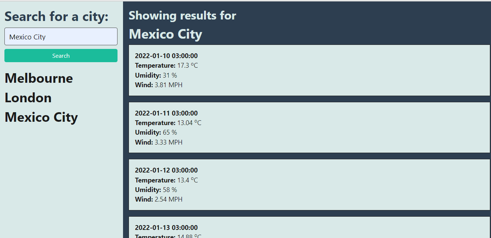

# Weather_Dashboard

## Table of contents
* [General info](#general-info)
* [Technologies](#technologies)
* [Demo](#demo)
* [Working Application](#working-application)
* [Project Status](#project-status)
* [Room for Improvement](#room-for-improvement)
* [Contact Me](#contact-me)

## General info

The goal of the project is to create an application that allows a user to search for a city to see its weather. When the user insert the city name, the weather of the current day is displayed with the forecast for the following 4 days. The user can see the temperature, humidity, wind speed and date. If the user click on a past city searched, results for that location are displayed again. 

## Technologies

Project is created with:
* HTML
* JavaScript
* CSS

## Demo
<a href="http://127.0.0.1:5501/index.html" target="_blank">Demo</a>

## Working Application
The following image shows the web application's appearance:

## Project Status
* Working with changes required

## Room for Improvement
Room for improvement:
* Implement the correct API
* Display weather icons 

## Contact me 
Created by [Nico Pasqualini](https://nico749.github.io/Personal-portfolio-/) - feel free to contact me!

